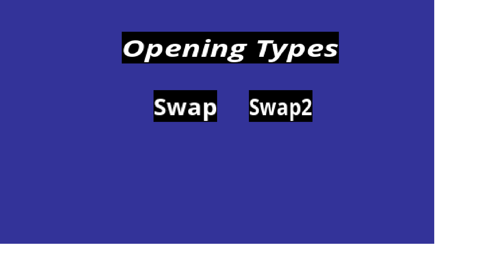
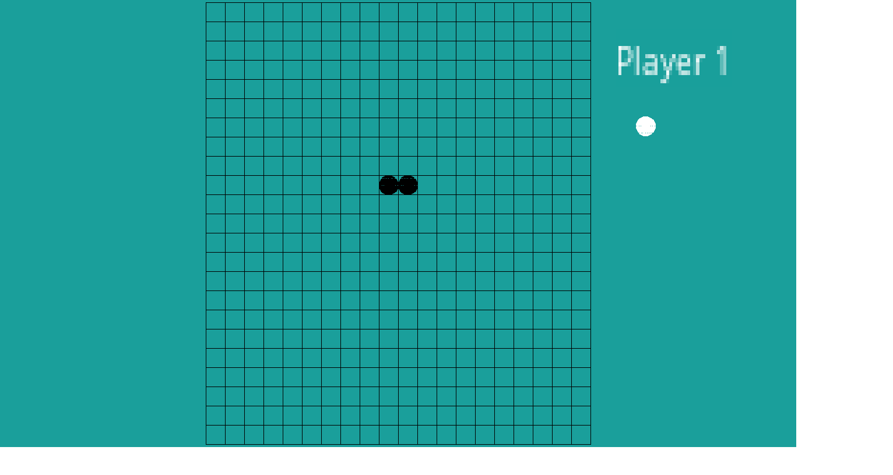
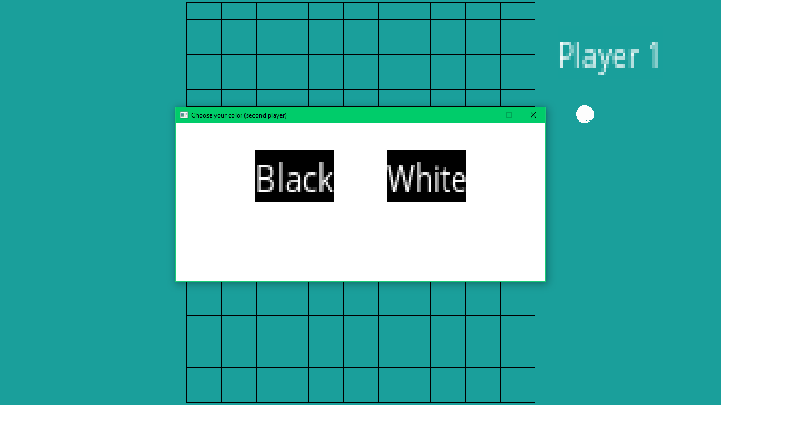
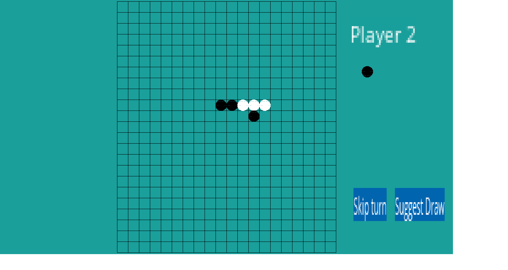
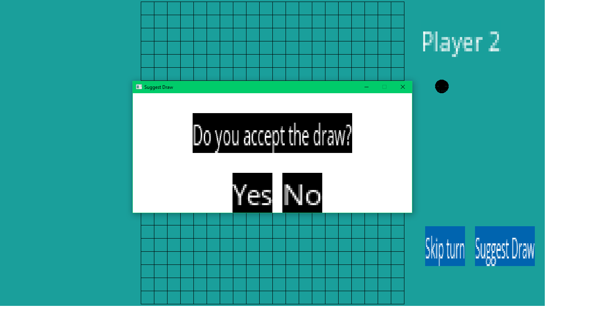

# Game-implemented-using-SDL
Gomoku game implemented in C++, using SDL (Simple DirectMedia Layer). The game is created with 2 opening types(see: http://gomokuworld.com/gomoku/2) and is a 1 vs 1 game.

If you want to try the game on your PC you will have to link the file to the SDL library. You can find info about this here http://lazyfoo.net/tutorials/SDL/index.php in the first tutorial.
 Here are some printscreens with the game:
 
  
   
    
     
 

